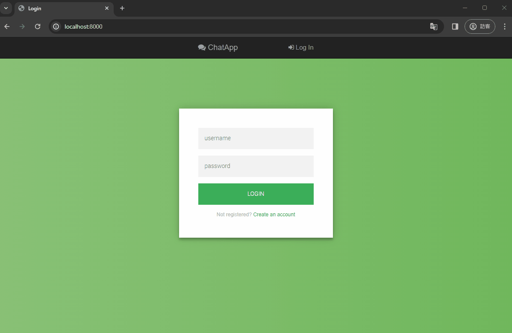
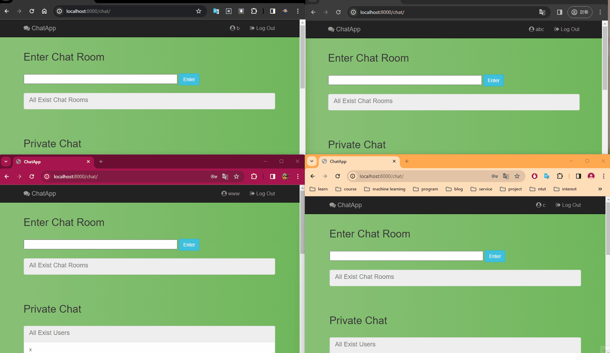
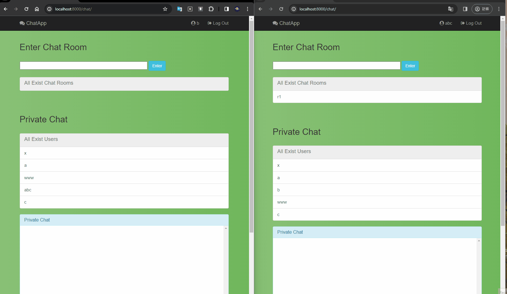
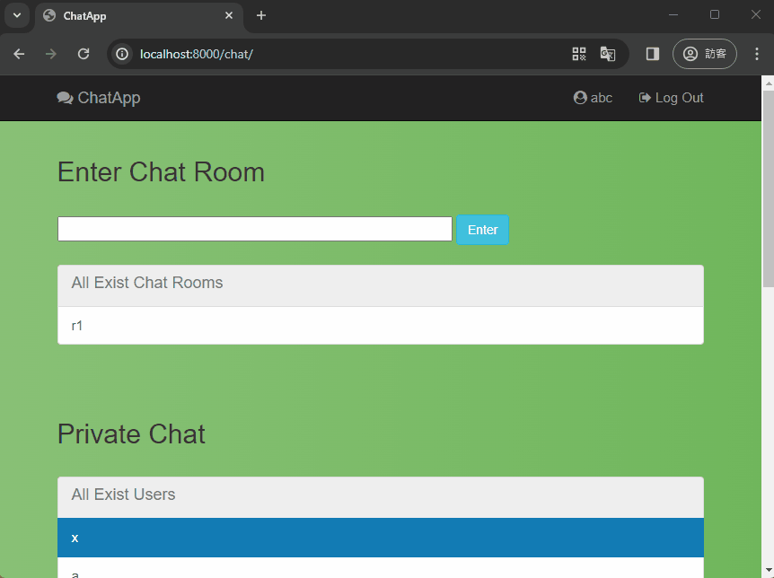

# chat_app
 basic chat room system using django

### Demo

* Authentication, Registration

* Chat Room

* Private Chat

* Logout

### Reference

https://www.youtube.com/watch?v=nGIg40xs9e4&ab_channel=TechWithTim

https://github.com/anshuUnity/whatsapp-clone

https://channels.readthedocs.io/en/stable/tutorial

https://github.com/narrowfail/django-channels-chat/tree/master
